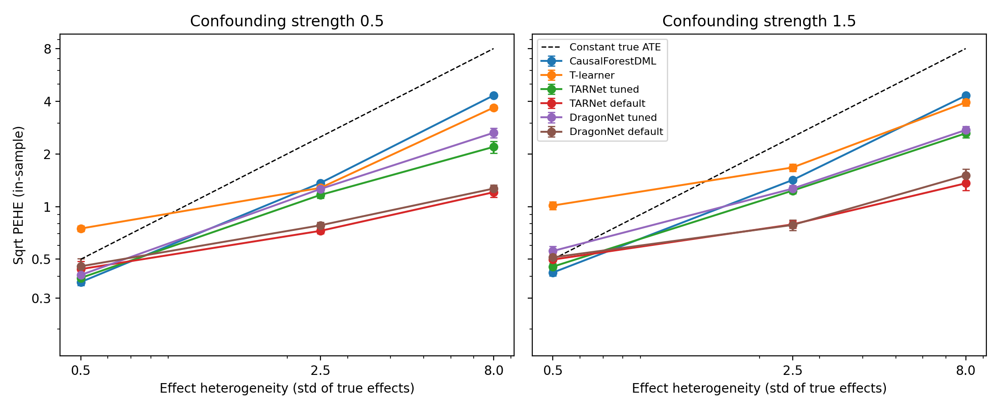

# Do Tuned Neural CATE Estimators Transfer? TARNet and DragonNet on IHDP and Controlled Synthetic Data

This repository compares two neural estimators of individual treatment effects, TARNet and DragonNet (both implemented in PyTorch), with a T-learner, a causal forest and a linear double machine learning estimator. The comparison runs on the IHDP benchmark and on a synthetic benchmark where effect heterogeneity and confounding strength are controlled. All tuning uses IHDP replications 0-19, configurations are frozen, and the final comparison uses held-out replications 20-99.

Paper: [paper/main.pdf](paper/main.pdf)

## Main findings

- On held-out IHDP replications (20-99), tuned TARNet and DragonNet have mean in-sample sqrt(PEHE) of 0.82 and 0.90, against 1.97 for the T-learner and 3.41 for CausalForestDML. TARNet has lower error than the T-learner in 79 of 80 replications and than CausalForestDML in 77 of 80.
- DragonNet's propensity head and targeted regularisation improve on the same network without them (lower error in 59 of 80 replications against the variant with no extra terms, and in 66 of 80 against the propensity-loss-only variant). The gain appears only when both are present. We found no consistent advantage over TARNet on either benchmark.
- Settings tuned on IHDP did not transfer. At moderate and high heterogeneity (h = 2.5 and 8) on synthetic data, the tuned networks have higher error than the default ones in all 10 seeds in all four cells. A sensitivity analysis in one cell points to weight decay as the main cause.
- CausalForestDML has the lowest mean error when true effects are nearly constant (h = 0.5), and TARNet beats it in all 10 seeds at h = 2.5 and h = 8.

## Results

IHDP held-out replications 20-99, sqrt(PEHE) (lower is better). Mean with 95% confidence interval half-width, and median.

| Estimator | In-sample mean | In-sample median | Out-of-sample mean | Out-of-sample median |
|---|---|---|---|---|
| Naive | 5.64 +/- 1.74 | 2.70 | 5.74 +/- 1.88 | 2.74 |
| LinearDML | 3.10 +/- 0.90 | 1.50 | 3.16 +/- 0.92 | 1.66 |
| CausalForestDML | 3.41 +/- 1.06 | 1.61 | 3.60 +/- 1.23 | 1.68 |
| T-learner | 1.97 +/- 0.59 | 0.91 | 2.66 +/- 0.94 | 1.18 |
| DragonNet | 0.90 +/- 0.20 | 0.57 | 1.04 +/- 0.32 | 0.59 |
| TARNet | 0.82 +/- 0.19 | 0.49 | 0.95 +/- 0.29 | 0.53 |

Means are dominated by a few replications with very large true effects, so medians are reported alongside them.

Synthetic benchmark, mean in-sample sqrt(PEHE) over 10 seeds. h is the standard deviation of the true effects and c is the confounding strength. "Tuned" uses the settings frozen on IHDP, and "default" uses weight decay 0.0001 and width 200.

| h | c | CausalForestDML | T-learner | TARNet tuned | TARNet default | DragonNet tuned | DragonNet default |
|---|---|---|---|---|---|---|---|
| 0.5 | 0.5 | 0.370 | 0.749 | 0.391 | 0.439 | 0.407 | 0.456 |
| 0.5 | 1.5 | 0.420 | 1.014 | 0.454 | 0.498 | 0.557 | 0.513 |
| 2.5 | 0.5 | 1.365 | 1.279 | 1.166 | 0.726 | 1.261 | 0.781 |
| 2.5 | 1.5 | 1.418 | 1.673 | 1.233 | 0.791 | 1.266 | 0.785 |
| 8.0 | 0.5 | 4.318 | 3.678 | 2.194 | 1.208 | 2.642 | 1.267 |
| 8.0 | 1.5 | 4.306 | 3.940 | 2.622 | 1.359 | 2.739 | 1.509 |



Weight-decay sensitivity, TARNet at h = 8, c = 1.5 (mean in-sample sqrt(PEHE), 10 seeds): 1.36 at the default (weight decay 0.0001, width 200); 1.60, 2.63 and 3.21 at weight decay 0.001, 0.01 and 0.03 with width 200; and 1.41 and 1.73 at weight decay 0.0001 with widths 64 and 16. This analysis was run after the main comparison and did not affect any selection.

## Frozen configurations

Selected by median in-sample sqrt(PEHE) on IHDP replications 0-19 and saved in `results/frozen_configs.json`.

| Estimator | Setting | Configurations tried |
|---|---|---|
| T-learner | minimum leaf 3, max features 0.5 | 13 |
| CausalForestDML | minimum leaf 5, max samples 0.5 | 12 |
| TARNet | weight decay 0.01, representation width 16 | 13 |
| DragonNet | weight decay 0.03, representation width 16 | 13 |

LinearDML was not tuned. The best neural widths lie at the lower edge of the search grid, so smaller widths were not explored.

## Repository structure

```
neural_cate.ipynb   full experiment notebook, run top to bottom
results/            per-replication and per-seed CSVs, frozen configurations
figures/            figures used in the paper
paper/              LaTeX source, bibliography and compiled PDF
requirements.txt
LICENSE
README.md
```

Key files in `results/`: `ihdp_baselines.csv`, `ihdp_final.csv`, `ihdp_ablation.csv`, `ihdp_heldout_table.csv`, `synthetic_results.csv`, `synthetic_sensitivity.csv`, `tuning_dev.csv`, `baseline_tuning_dev.csv` and `frozen_configs.json`.

## Notebook outline

1. Setup and data
2. Metrics and baseline estimators
3. TARNet and DragonNet
4. Tuning on development replications 0-19
5. Final IHDP comparison and DragonNet ablation
6. Tables and figures
7. Synthetic benchmark
8. Sensitivity analysis

## Reproducing the results

[](https://colab.research.google.com/github/dishayayyy/neural-cate-benchmark/blob/main/neural_cate.ipynb)

1. Open `neural_cate.ipynb` in Colab and run the setup cells. They install EconML and mount Google Drive. Set `PROJECT_ROOT` in the Drive cell to the folder where data and results should be stored.
2. The data cell downloads the two IHDP benchmark files (`ihdp_npci_1-100.train.npz` and `ihdp_npci_1-100.test.npz`) into the `data/` folder under `PROJECT_ROOT`. If the download fails, place the two files there manually.
3. Run the notebook top to bottom. The baseline run, final IHDP comparison, ablation, synthetic grid and sensitivity analysis save results to CSV after every fit and skip finished runs, so an interrupted session can resume. The tuning cells recompute their grids and overwrite their CSVs, and they also write `frozen_configs.json`. To recompute everything from scratch, use an empty `PROJECT_ROOT`.
4. Colab can drop its connection to Drive during long runs (the error reads `Transport endpoint is not connected`). If that happens, re-run the Drive cell and continue from the interrupted cell.

All fits are seeded. Repeated runs with the same seeds reproduced the neural-network results to three decimal places and the tree-based results to within 0.001.

## Method summary

- **Data.** IHDP: 100 replications of the standard semi-synthetic benchmark (672 training and 75 test units each, 25 covariates). Synthetic: 10 covariates, 2,000 training and 500 test units per dataset, 10 seeds per cell. The true effect standard deviation is set to h, and treatment assignment strength is set by c.
- **Networks.** TARNet has a three-layer ELU representation and two outcome heads. DragonNet adds a propensity head and a targeted-regularisation term. Both use Adam, early stopping on the factual validation loss, and standardised inputs and outcomes.
- **Tuning protocol.** All tuning uses IHDP replications 0-19, configurations are frozen before the held-out run, and comparisons use paired per-replication differences with sign and Wilcoxon tests.
- **Metrics.** sqrt(PEHE) and absolute ATE error, in-sample and out-of-sample.

## Limitations

- IHDP replications reuse the same covariates, so tests describe variation across outcome draws and not across populations.
- The synthetic benchmark has one effect-surface design, and heterogeneity and confounding are coupled because the effect depends on the covariates that drive treatment.
- The neural networks were tuned over weight decay and width only. The forest and T-learner searches were narrower, and LinearDML was not tuned.
- Configurations were selected using the true individual effects, which are unavailable outside benchmarks.
- The PyTorch implementations are our own and may differ from the reference implementations. Parity was not verified.
- The effect-spread terciles and the weight-decay sensitivity analysis were run after seeing the main results and are exploratory. The sensitivity analysis covers TARNet in one synthetic cell.

## Environment

Python 3.13.15, PyTorch 2.11.0 (CPU), scikit-learn 1.6.1, EconML 0.17.0, NumPy 2.1.3, pandas 2.2.3, SciPy 1.16.3, run on Google Colab.

## References

- Shalit, Johansson and Sontag. Estimating individual treatment effect: generalization bounds and algorithms. ICML 2017 (TARNet).
- Shi, Blei and Veitch. Adapting neural networks for the estimation of treatment effects. 2019 (DragonNet).
- Hill. Bayesian nonparametric modeling for causal inference. Journal of Computational and Graphical Statistics, 2011 (IHDP).
- Battocchi et al. EconML: A Python Package for ML-Based Heterogeneous Treatment Effects Estimation.

The full bibliography is in `paper/references.bib`.

## License

MIT. See [LICENSE](LICENSE).
